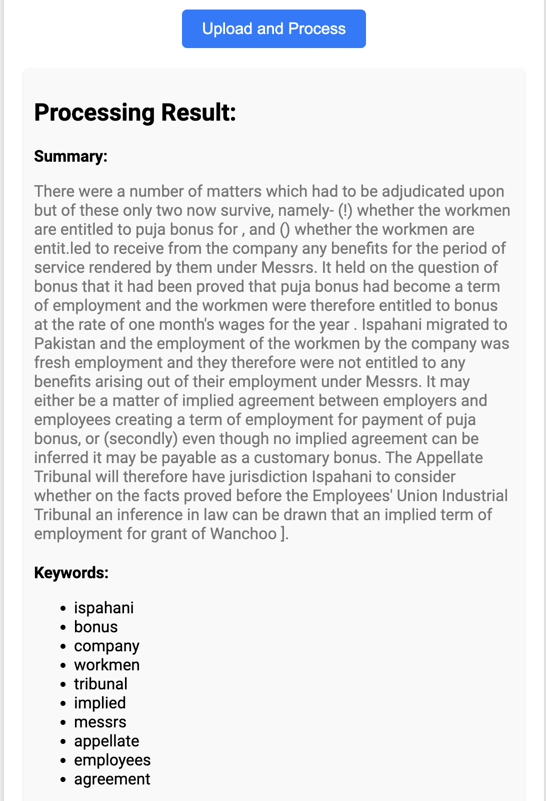

# PDF Processing Pipeline Documentation

## Overview

This repository provides a comprehensive pipeline for processing PDFs, which includes:
1. Downloading PDF files from given URLs.
2. Moving PDFs into different folders based on the number of pages.
3. Parsing the text content of the PDFs.
4. Summarizing the extracted text and extracting relevant keywords.
5. Storing metadata and results in a MongoDB database.
6. Exporting MongoDB collections for analysis.

The pipeline makes use of Python libraries for PDF processing, concurrency, and MongoDB operations.



## Requirements

- Python 3.7+
- MongoDB running on `localhost:27017`
- Required Python libraries:
  - `requests`
  - `PyMuPDF` (install via `pip install PyMuPDF`)
  - `pymongo` (install via `pip install pymongo`)
  - `bson` (for exporting MongoDB data)

## Setup Instructions

1. **Clone the repository**
   ```sh
   git clone <repository_url>
   cd <repository_name>
   ```

2. **Set up a virtual environment**
   ```sh
   python3 -m venv venv
   source venv/bin/activate  # On Windows use: venv\Scripts\activate
   ```

3. **Install the required dependencies**
   ```sh
   pip install -r requirements.txt
   ```

4. **Configure MongoDB**
   - Ensure MongoDB is installed and running.
   - The default URI is `mongodb://localhost:27017/`. Modify this in the code if necessary.

5. **Dataset Setup**
   - Add your dataset JSON file (`Dataset.json`) with URLs for the PDFs to the project root directory.

## Folder Structure

- **main.py**: Entry point script to run the pipeline.
- **pdf_utils.py**: Contains functions for downloading, moving, and parsing PDF files.
- **mongodb_utils.py**: Handles MongoDB interactions.
- **summarization.py**: Functions for summarizing parsed text and extracting keywords.
- **json_mongodb_utils.py**: Utility functions for saving results in JSON format.
- **pymongo_utils.py**: Functions for setting up the MongoDB connection and other operations.
- **logs**: Logs error messages for easier troubleshooting.

## How to Run the Pipeline

1. **Run MongoDB**
   Make sure MongoDB is running before you start the script.
   ```sh
   mongod
   ```

2. **Run the Pipeline**
   Execute `main.py` to start the complete PDF processing workflow.
   ```sh
   python main.py
   ```

   The script will:
   - Download PDFs.
   - Move them to respective folders (short, medium, long) based on page count.
   - Parse the text content.
   - Summarize the text and extract keywords.
   - Save the summary, keywords, and metadata into MongoDB and as JSON files.

## Features

1. **Concurrency**: The pipeline uses concurrent downloading and parsing of PDFs for efficiency.

2. **Error Handling**:
   - If MongoDB connection fails, it retries 3 times before terminating.
   - Detailed error logging is available in `pipeline_errors.log` for every operation.

3. **Summarization and Keyword Extraction**:
   - Summary generation is based on the length of the document.
   - Keyword extraction uses domain-specific rules for higher relevance.

4. **Performance Metrics**:
   - Logs the time taken for each document processing task.

5. **Data Storage**:
   - Results are saved in MongoDB, including metadata, summary, keywords, and error statuses.
   - All results are also saved as JSON files for easy access and sharing.

## Folder Cleanup
After each processing, the `summaries` and `keywords` folders are deleted to keep the file system clean. All relevant data is stored in MongoDB and JSON files under a dedicated `json` folder.

## MongoDB Schema
The MongoDB schema includes the following fields:
- `document_name`: Name of the document.
- `path`: File path of the document.
- `size`: Size of the document in bytes.
- `url`: URL from where the PDF was downloaded.
- `status`: Status (`downloaded`, `processed`, `error`).
- `summary`: Generated summary of the document.
- `keywords`: Extracted keywords.
- `processing_time`: Time taken to process the document.
- `error_message`: Stores any error messages if the process fails.

## Exporting MongoDB Data
To export the MongoDB collection to a JSON file:
```sh
python main.py  # The `test_export_collection()` function exports MongoDB data.
```
The exported file is saved as `exported_mongodb_collection.json`.

## Performance Tracking
The pipeline tracks the time taken for each document and logs it. Memory usage and other performance metrics can be added to further enhance monitoring.

## Testing & Validation
The pipeline has been tested with short, medium, and long documents to ensure proper categorization and correct processing.
- **Document Length Categorization**: PDFs are categorized as:
  - Short (1-10 pages)
  - Medium (11-30 pages)
  - Long (30+ pages)

## Troubleshooting
- **MongoDB Connection Issues**: Check if MongoDB is running and accessible at `localhost:27017`. If needed, modify the URI in the `mongodb_utils.py`.
- **Missing Dependencies**: Ensure all dependencies are installed using `pip install -r requirements.txt`.
- **Incomplete Downloads**: Check network connection. The `download_pdf` function retries a few times before giving up.
- **Error Logs**: Check `pipeline_errors.log` for detailed error messages.

## Docker Setup (Optional)
To set up the pipeline in a Docker container:
1. Create a `Dockerfile` and add all necessary environment configurations.
2. Build and run the container.
```sh
docker build -t pdf_pipeline .
docker run -d -p 27017:27017 pdf_pipeline
```

## Contributing
Contributions are welcome! Please create a pull request with a description of your changes.

## Contact
For issues, please open an issue on GitHub.
